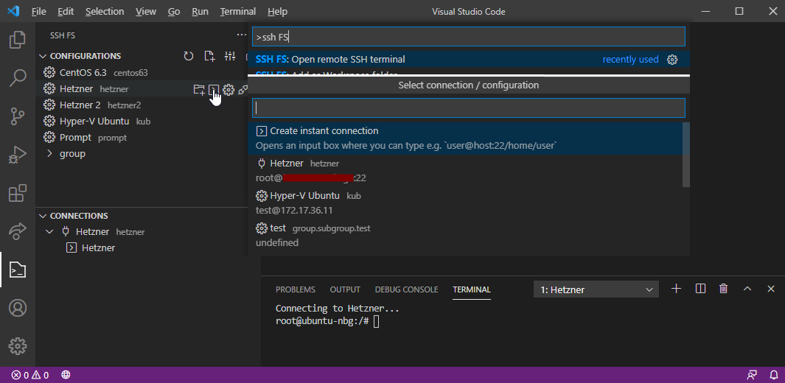

# SSH FS

 

 

This extension makes use of the new FileSystemProvider, added in version 1.23.0 of Visual Studio Code. It allows "mounting" a remote folder over SSH as a local Workspace folder.

## Summary
* Use a remote directory (over SSH) as workspace folder
* Instantly create one or multiple terminals on the same host
* A built-in UI to add, edit and remove configurations
* Use agents, including Pageant and OpenSSH on Windows
* Use private keys (any supported by ssh2-streams, including PuTTY's PPK)
* Get prompted for a password/passphrase (plain text password aren't required)
* Easily create configurations that reference a PuTTY session/configuration
* Create tasks that run commands on a remote host (remote version of "shell" task type)
* Have multiple SSH (and regular) workspace folders at once
* Make use of SOCKS 4/5 and HTTP proxies and connection hopping

## Usage
Use the command `SSH FS: Create a SSH FS configuration`, or open the Settings UI using the `SSH FS: Open settings and edit configurations` and click Add:

In this UI, you can also edit/delete existing configurations:

To connect, either rightclick the name in the Explorer tab, or use the command panel:

This will add a Workspace folder linked to a SSH (SFTP) session:

## Changelog 1.18.0
Starting from version 1.18.0 of the extension, a few new features are added:

### Terminals
The configurations for SSH file systems can now also be used to spawn terminals:

Currently the working directory will always be the user's home directory, similar to directly connecting to the server over ssh. I'm thinking about making it automatically move to the `root` directory if possible.

### New task type
This extension adds a new task type `ssh-shell` which can be used to run commands on a configured remote host:

Currently only the `command` field is supported. The goal is to replicate part of the `shell` task structure, e.g. an `args` array, support for `${workspaceFolder}`, ...

### Connection reuse
The way the extension connects to the remote hosts is reworked. The extension tries to only keep one connection per host active, with one connection supporting the file system access and a bunch of terminals. If the saved configuration has changed after a connection has been established, the next terminal/filesystem will start a new connection, but leave the first one alive and fine.

A handy enhancement this brings is that prompts (e.g. for passwords) should only happen once. As long as a connection is open (either by having a connected file system or terminal to the host), opening e.g. a new terminal skips the whole authentication phase and is basically instant.

Connections without an active file system or terminals will automatically be closed somewhere after 5 seconds. If you're planning on running a bunch of tasks on a host without having a workspace folder connected to it, keeping a terminal open is handy and advised.

### Logging
Logging has slightly improved, resulting in better logs that help with resolving issues.